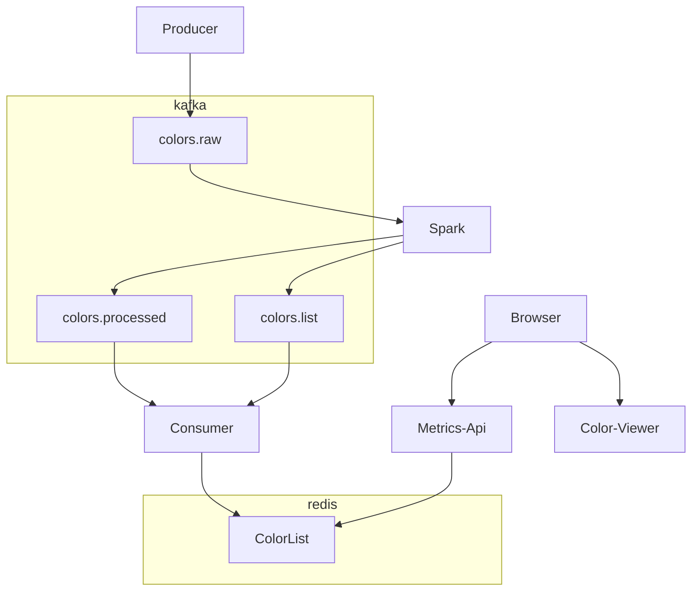

```mermaid
graph TB
    subgraph kafka
        colors.raw;
        colors.processed;
        colors.list;
    end

    subgraph redis
        ColorList;
    end

    Producer --> colors.raw
    colors.raw --> Spark
    Spark --> colors.processed
    Spark --> colors.list
    colors.processed --> Consumer
    colors.list --> Consumer
    Consumer --> ColorList;
    Metrics-Api --> ColorList;
    Browser --> Metrics-Api;
    Browser --> Color-Viewer;
```